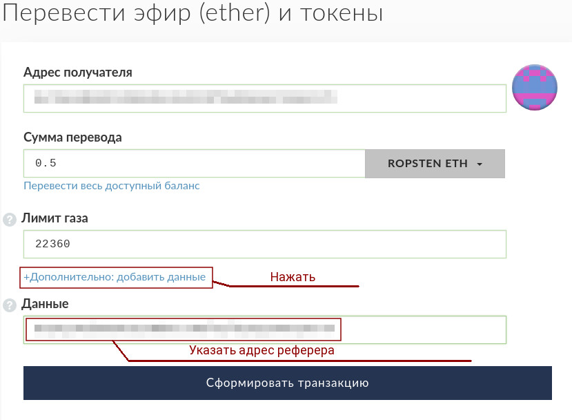

# Реферальная система
## Терминология
* _Реферер_ - пользователь, который привлекает другогих пользователей к получению услуги
* _Реферал_ - пользователь, которго реферер привлек к получению услуги
## Алгоритм работы
* Реферер привлекает к покупке рферала
* Реферал при покупке указывает данные рферера
* Система начисляет бонусы рефереру в процентах от обьема услуги
## Мотивация
* Реферер мотивирован привлекать качественных клиентов так как он получает прибыль от обьема покуки клиента
* Реферал должен быть мотивирован для указания данных реферера ___этого пока нет___
## Инстуркция для реферера
Рефереру достаточно сказать, чтобы реферал при покупке токенов в поле input data указал адрес реферера
## Инструкция для реферала
Рефералу необходимо при покупке токена указать адрес реферера в поле input data (дополнительные данные). В !(MyEtherWallet)[https://www.myetherwallet.com/] это выглядит так:

